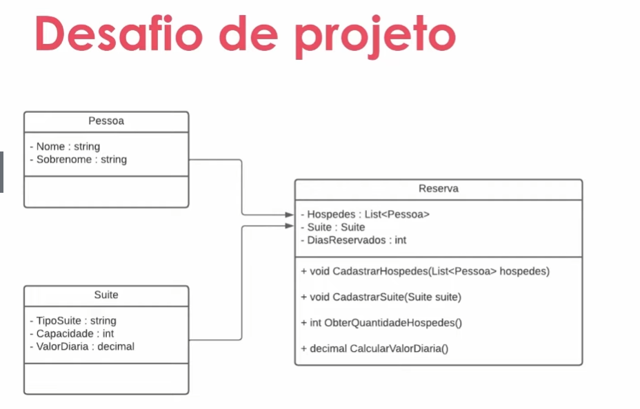

# Sistema de Hospedagem no Csharp/.NET

Este é um sistema simples e eficiente para gerenciar as reservas de um hotel. Ele permite que você crie hóspedes, suítes e faça reservas.

<b>Funcionalidades</b>

<b>Criação de Hóspedes:</b> Você pode criar hóspedes com o nome desejado. 
<b>Criação de Suítes:</b> Você pode criar suítes com o tipo desejado, capacidade e valor diário. 
<b>Reservas:</b> Você pode fazer reservas para um número específico de dias, cadastrar hóspedes na reserva e cadastrar a suíte na reserva. 

Este exemplo cria dois hóspedes, uma suíte e faz uma reserva para 10 dias. Em seguida, imprime várias informações sobre a reserva.

Esperamos que este sistema possa ajudá-lo a gerenciar as reservas do seu hotel de maneira mais eficiente!

